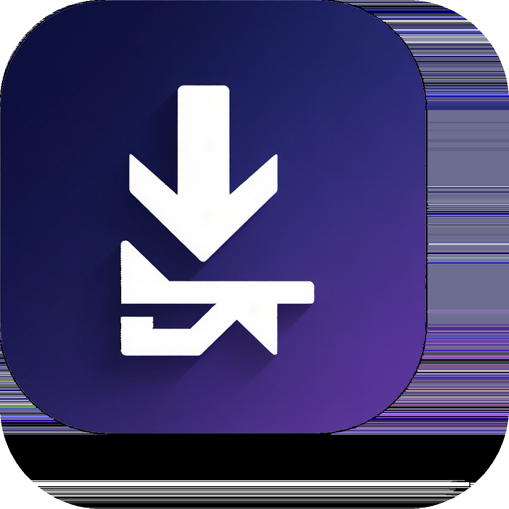
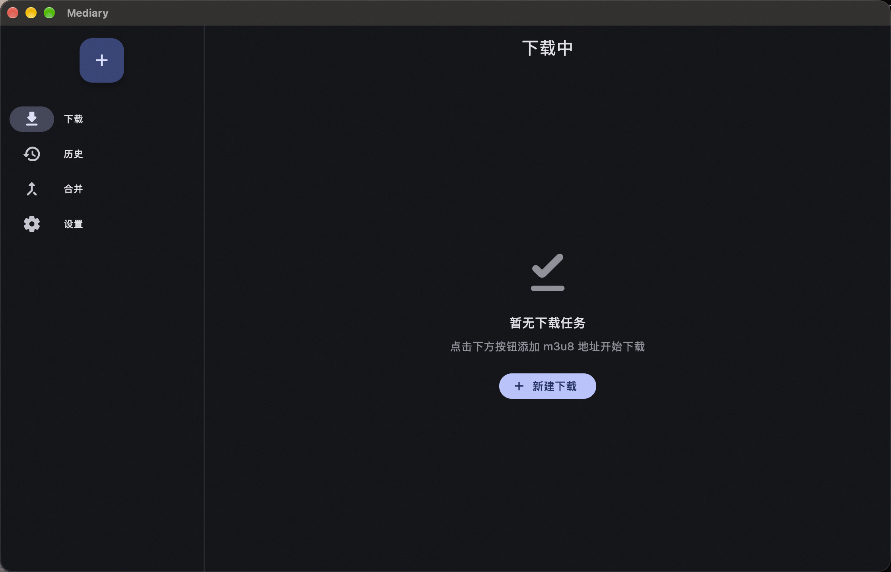
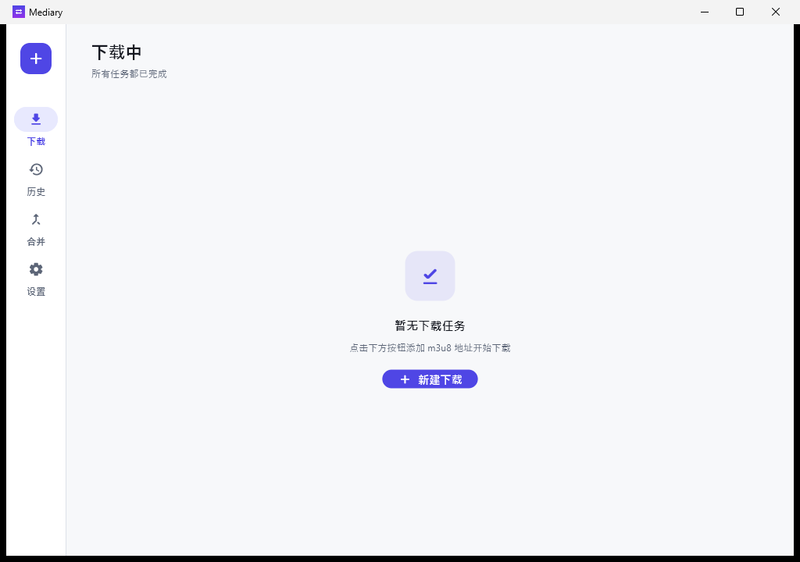

<p align="center">
  
</p>

<p align="center">
  
</p>

<h1 align="center">Mediary</h1>

<p align="center">
  A cross-platform <strong>M3U8 / HLS</strong> media downloader built with Flutter.<br />
  Parse, download, decrypt and merge streaming segments into a single playable video.
</p>

<p align="center">
  <a href="README.md">简体中文</a> | <strong>English</strong>
</p>

<p align="center">
  <a href="https://github.com/elementlo/stream-mediary/releases">
    
  </a>
  <a href="https://github.com/elementlo/stream-mediary/actions/workflows/release.yml">
    
  </a>
  <a href="https://flutter.dev">
    
  </a>
  <a href="https://github.com/elementlo/stream-mediary/blob/main/LICENSE">
    
  </a>
  
</p>

<p align="center">
  <a href="#-features">Features</a> •
  <a href="#-screenshots">Screenshots</a> •
  <a href="#-download">Download</a> •
  <a href="#-getting-started">Getting Started</a> •
  <a href="#-architecture">Architecture</a> •
  <a href="#-contributing">Contributing</a>
</p>

---

## ✨ Features

- **🔗 HLS parsing** — Paste an `.m3u8` URL and preview segment count, duration, encryption and estimated size. Master playlists expose every quality/bandwidth variant for selection.
- **⚡ Concurrent downloads** — Two-level scheduling: task-level concurrency (default 3) and per-task segment concurrency (default 8).
- **🔐 AES decryption** — Pure-Dart streaming AES-128/192/256-CBC decryption, with support for custom HTTP headers and user-supplied KEY / IV overrides.
- **🧩 Smart merging** — Segments are concatenated into a single `.ts`; when `ffmpeg` is detected it is losslessly remuxed to `.mp4` (`-c copy`), falling back to `.ts` on failure.
- **⏯️ Resume & retry** — Interrupted downloads resume automatically after restart; completed segments are never re-fetched. Per-segment exponential-backoff retry.
- **🎬 Built-in player** — Play downloaded `.ts` / `.mp4` files in-app with full controls and desktop keyboard shortcuts.
- **🕘 History** — Persistent task history with replay, re-download, "open containing folder" and delete.
- **🎨 Material 3** — Light / dark / system theme, adaptive navigation (bottom bar on mobile, rail on desktop).
- **🌍 Internationalization** — Chinese (default) and English.

## 📱 Screenshots

<p align="center">
  <table>
    <tr>
      <td align="center"><sub><b>Android</b></sub><br /></td>
      <td align="center"><sub><b>iOS</b></sub><br /></td>
      <td align="center"><sub><b>macOS</b></sub><br /></td>
      <td align="center"><sub><b>Windows</b></sub><br /></td>
    </tr>
  </table>
</p>

## ⬇️ Download

Grab the latest pre-built binaries for your platform from the **[Releases](https://github.com/elementlo/stream-mediary/releases)** page.

| Platform | Artifact |
|---|---|
| Windows | `.exe` / `.msix` |
| macOS | `.dmg` / `.app` |
| Android | `.apk` |
| iOS | Build from source (sideload) |

## 🚀 Getting Started

### Prerequisites

- [Flutter](https://docs.flutter.dev/get-started/install) **3.47+** (Dart SDK ^3.13)
- Platform toolchain for your target (Xcode, Android Studio, Visual Studio, etc.)
- *(Optional)* `ffmpeg` on `PATH` for MP4 remuxing

### Build from source

```bash
# 1. Clone the repository
git clone https://github.com/elementlo/stream-mediary.git
cd stream-mediary

# 2. Install dependencies
flutter pub get

# 3. Run code generation (drift, freezed, riverpod, l10n)
dart run build_runner build --delete-conflicting-outputs

# 4. Run on a connected device / desktop
flutter run
```

To produce a release build:

```bash
flutter build apk        # Android
flutter build ios        # iOS
flutter build windows    # Windows
flutter build macos      # macOS
```

## 🏗️ Architecture

Mediary follows a layered, unidirectional architecture. The download **engine is pure Dart with zero Flutter dependencies**, so it runs in a dedicated isolate and is fully unit-testable.

```
┌─────────────────────────────────────────────┐
│ features/   (UI layer)                        │
│   shell · new_download · downloads ·          │
│   history · player · settings                 │
├─────────────────────────────────────────────┤
│ providers/  (Riverpod state layer)            │
├─────────────────────────────────────────────┤
│ data/       (drift DB + repositories)         │
├─────────────────────────────────────────────┤
│ engine/     (pure-Dart download engine)       │
│   m3u8 · scheduler · net · crypto · merge     │
└─────────────────────────────────────────────┘
```

**Tech stack**

| Concern | Choice |
|---|---|
| State management | `flutter_riverpod` + `riverpod_annotation` |
| Routing | `go_router` |
| Networking | `dio` |
| Decryption | `pointycastle` (pure Dart AES-CBC) |
| Database | `drift` + `sqlite3_flutter_libs` |
| Playback | `media_kit` |
| Models | `freezed` + `json_serializable` |

See [`docs/design.md`](docs/design.md) for the full design document and [`docs/requirements.md`](docs/requirements.md) for the specification.

## 🧪 Testing

```bash
flutter test              # unit tests (parser, decryptor, merger, scheduler)
flutter test --coverage   # with coverage report
```

The core engine targets **≥70% unit-test coverage**.

## 🤝 Contributing

Contributions are welcome! Please feel free to open an issue or submit a pull request.

1. Fork the repository
2. Create your feature branch (`git checkout -b feature/amazing-feature`)
3. Commit your changes (`git commit -m 'Add some amazing feature'`)
4. Push to the branch (`git push origin feature/amazing-feature`)
5. Open a Pull Request

## ⚠️ Disclaimer

Mediary is provided for **personal, educational and legitimate use only**. You are responsible for ensuring you have the rights to download any content. Do not use this software to infringe copyright or violate the terms of service of any provider.

## 📄 License

Distributed under the **MIT License**. See [`LICENSE`](LICENSE) for more information.

---

<p align="center">
  Made with 💙 using Flutter · <a href="https://github.com/elementlo/stream-mediary">elementlo/stream-mediary</a>
</p>
